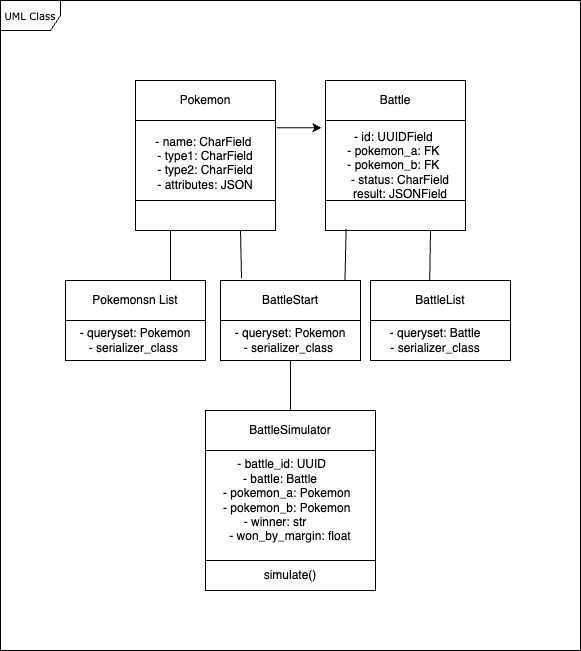

# Pokémon Battle Simulation Backend Application

Hello, geeks! Welcome to the **Pokémon Battle Simulation** backend application. In this simulation, you can choose and battle with your favorite Pokémon while enjoying some relaxing game time. I hope you have a great experience!

This guide will walk you through the steps to set up the application on your machine. Let’s get started!

## Live Demo:
You can access hosted applicatio using http://3.108.220.255:8000/

## Prerequisites

Before we begin, please ensure that **Docker** is installed on your machine. If you don't have Docker installed yet, you can download it from [Docker's official site](https://www.docker.com/get-started).

## Installation and Setup

1. **Clone the Repository**

   First, clone the application repository to your local machine using the command below:

   ```bash
   git clone https://github.com/shivagangula/betafront-task.git
   ```

   Then, navigate into the cloned repository:

   ```bash
   cd betafront-task
   ```

2. **Build the Application with Docker**

   Use Docker Compose to build the application for mac:

   ```bash
   docker compose build
   ```
   Use Docker Compose to build the application for windows/linux:

   ```bash
   docker-compose build
   ```

3. **Start the Application**

   Once the build process is complete, start the application by running:
   for mac
   ```bash
   docker compose up
   ```
   for linux/windows
   
   ```bash
   docker compose up
   ```

4. **Access the Simulator**

   That’s it! Now your Pokémon Battle Simulator is up and running. You can access the application through Postman. To make things easier, we’ve provided a Postman collection for you to use.

   Please download and import the provided Postman collection into your Postman workspace to start interacting with the simulator.

   We created a html page also so you can play with UI http://3.108.220.255:8000/

## Postman Collection

You can find the Postman collection file [here]("./docs/Betafront.pc.json"),or in this repo /doc/Betafront.pc.json which includes pre-configured API requests to interact with the Pokémon Battle Simulation backend. After importing the collection into Postman, you will be ready to send requests and enjoy the battles!

## UML Daigram

